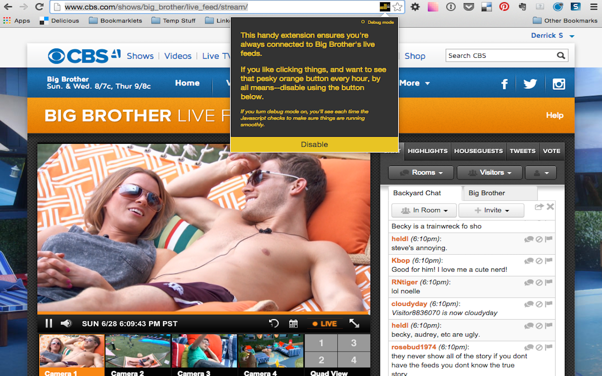

# Big Brother 24/7 Live Feeds

If you're a fan of the [Big Brother live feeds](http://www.cbs.com/shows/big_brother/live_feed/stream/), you may have run into the annoying "I'm still watching" button that pops up on the screen every now and then. Wouldn't it be great if you could stop that from happening? Maybe you're one of those creepy people that like to stream the feeds in the background on a TV 24/7 (don't worry, you're not the only one).

This extension can be installed on the [Chrome Web Store](https://chrome.google.com/webstore/detail/big-brother-247-live-feed/objafcghcopeogljkknflhglgnepgfcc). Once installed, you'll see an icon appear in the URL/search bar in Chrome. You don't need to do anything, just go to the live feeds and enjoy.

There are a couple of options available by clicking on the icon--you can disable the extension or turn on debug mode.

## Screenshot

